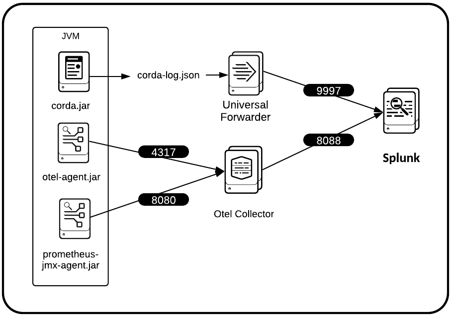

# Splunk App for Corda


Splunk App for Corda gives you insight into your blockchain infrastructures built on [Corda](https://www.corda.net/). With the new Splunk App for Corda, you will get the building blocks to obtain visibility and monitoring of Corda node application logs, metrics, and traces, in addition to transaction data from the distributed ledger itself!

Splunk App for Corda makes it easy for you to fully monitor your Corda Enterprise and OS environment. The example in [examples/docker](https://github.com/splunkdlt/splunk-app-for-corda/blob/main/examples/docker) illustrates how to implement infrastructure metric monitoring, as well as application trace, metric and log monitoring.

Splunk App for Corda utilizes the following:
- [JMX Prometheus Java Agent](https://mvnrepository.com/artifact/io.prometheus.jmx/jmx_prometheus_javaagent/0.13.0)
- [Open Telemetry Java Agent](https://github.com/open-telemetry/opentelemetry-java-instrumentation)
- [Open Telemetry Collector](https://github.com/open-telemetry/opentelemetry-collector-contrib)
- [collectd](https://docs.splunk.com/Documentation/Splunk/8.1.2/Metrics/GetMetricsInCollectd)
- [Splunk Universal Forwarder](https://docs.splunk.com/Documentation/Forwarder/8.1.2/Forwarder/Abouttheuniversalforwarder)
- [Splunk App for Infrastructure](https://splunkbase.splunk.com/app/3975/)
- [Splunk Add-on for Infrastructure](https://splunkbase.splunk.com/app/4217/)
- [Splunk App for Corda](https://github.com/splunkdlt/splunk-app-for-corda/releases)


If you want to learn more about Splunk's efforts to support R3 Corda, raise an issue here or email us at [blockchain@splunk.com](mailto:blockchain@splunk.com)

## Usage

Splunk App for Corda relies on having direct access to the environment where your Corda nodes are running. As such, you'll need to modify the start up command for your Corda nodes. The startup command is illustrated [here](https://github.com/splunkdlt/splunk-app-for-corda/blob/main/examples/docker/dockerfiles/node/entrypoint.sh#L11). Take note of the new dependencies you'll have, mentioned above. You can find an example of how to obtain and install them [here](https://github.com/splunkdlt/splunk-app-for-corda/blob/main/examples/docker/dockerfiles/node/Dockerfile).

In addition to the two java agents, make sure you install the following on your corda node host:
- collectd
- Splunk Universal Forwarder

Refer to the [example node dockerfile](https://github.com/splunkdlt/splunk-app-for-corda/blob/main/examples/docker/dockerfiles/node/Dockerfile#L16) for how to accomplish the above, or if you already have Splunk App for Infrastructure installed on your Splunk instance, follow the instructions in the App to add more data sources.

#### Corda Logging Spec (IMPORTANT!)

Splunk App for Corda relies on the Corda node logging in JSON. One of the most important updates you'll need to make to your Corda node startup is to specify a new logging configuration for Log4j2. You can see the full command [here](https://github.com/splunkdlt/splunk-app-for-corda/blob/main/examples/docker/dockerfiles/node/entrypoint.sh#L11). Specifically, you'll find the logging config [here](https://github.com/splunkdlt/splunk-app-for-corda/blob/main/examples/docker/dockerfiles/node/logging.xml), and will specify it like this:

```
java -Dlog4j.configurationFile=logging.xml -jar corda.jar
```

#### Logging arbitrary data

We have implemented a pattern for logging arbitrary data that is illustrated in the CorDapp used in the Docker example. This involves using `ThreadContext` to put additional strings into your logging context.

You'll need to:
- [include log4j2 core](https://github.com/corda/samples-kotlin/blob/766cb73d8afc76986d6585fc41515d7df7266817/Features/customlogging-yocordapp/workflows/build.gradle#L46) in your project.
- [import ThreadContext](https://github.com/corda/samples-kotlin/blob/766cb73d8afc76986d6585fc41515d7df7266817/Features/customlogging-yocordapp/workflows/src/main/kotlin/net/corda/samples/logging/flows/YoFlow.kt#L13) in your workflow.
- [`put` values into your logger `ThreadContext`](https://github.com/corda/samples-kotlin/blob/766cb73d8afc76986d6585fc41515d7df7266817/Features/customlogging-yocordapp/workflows/src/main/kotlin/net/corda/samples/logging/flows/YoFlow.kt#L48).
- [`remove` values from `ThreadContext` when done](https://github.com/corda/samples-kotlin/blob/766cb73d8afc76986d6585fc41515d7df7266817/Features/customlogging-yocordapp/workflows/src/main/kotlin/net/corda/samples/logging/flows/YoFlow.kt#L53).

### Splunk considerations

Specify your Splunk host in the following locations:
- On your node host, in the [Universal Forwarder outputs.conf](https://github.com/splunkdlt/splunk-app-for-corda/blob/main/examples/docker/dockerfiles/node/fwdr_outputs.conf#L6)
- In the Otel Collector config, [here](https://github.com/splunkdlt/splunk-app-for-corda/blob/main/examples/docker/tracing/otel-collector-config.yml#L20) and [here](https://github.com/splunkdlt/splunk-app-for-corda/blob/main/examples/docker/tracing/otel-collector-config.yml#L40).

Specify your Splunk HEC token in the following locations:
- In the Otel Collector config, [here](https://github.com/splunkdlt/splunk-app-for-corda/blob/main/examples/docker/tracing/otel-collector-config.yml#L18) and [here](https://github.com/splunkdlt/splunk-app-for-corda/blob/main/examples/docker/tracing/otel-collector-config.yml#L38).


#### On your Splunk instance

You'll need to add 3 indexes to your Splunk installation.
- name: `corda`, type: `event`
- name: `traces`, type: `event`
- name: `metrics`, type: `metric`

You will want to install our Splunk Apps and Add-ons to make sense of all of the new data being sent to your instance.
You can read more about infrastructure monitoring using our Infrastructure Monitoring Tooling [here](https://www.splunk.com/en_us/devops/infrastructure-monitoring-and-troubleshooting.html) 
and IT Essentials [here](https://www.splunk.com/en_us/software/it-essentials.html).

## Architecture / Getting Data In



If you're installing manually in your environment, please consider GDI architecture outline below.

### Splunk Configuration
- props.conf
  - You'll need to add an entry in `/opt/splunk/etc/system/local/props.conf` to tell splunk where to find the timestamp in the Corda JSON logs.
  - Relevant files: [props.conf](./examples/local_machine/props.conf)


### Corda Environment
- Corda Log4j2 JSON config
	- Splunk App for Corda relies on the Corda node logging in the JSON format. You will need to specify a log4j2 config to the corda node at runtime.
	- Relevant files: [logging.xml](./examples/local_machine/logging.xml), [start_node.sh](./examples/local_machine/start_node.sh)
- OpenTelemetry JavaAgent
	- The OpenTelemetry JavaAgent (otel-agent.jar) exposes full-fidelity trace data from Corda (operation, timespan). Examples of this include database performance traces and custom traces in CorDapps. The Otel Agent relies on environment variables for configuration and connection info for the Otel Colletor that should be supplied at runtime.
	- Relevant files: [fetch_javaagents.sh](./examples/local_machine/fetch_javaagents.sh), [start_node.sh](./examples/local_machine/start_node.sh) (note the OTEL_* environment variables)
- Prometheus JMX JavaAgent
	- The Prometheus JMX JavaAgent (prometheus-jmx-agent.jar) exposes the JMX metrics from Corda in Prometheus format. The Prometheus JMX JavaAgent relies on a local yaml file for configuration that should be available at runtime. This is mainly formatting rules.
	- Relevant files: [fetch_javaagents.sh](./examples/local_machine/fetch_javaagents.sh), [jmx_prometheus_config.yaml](./examples/local_machine/jmx_prometheus_config.yaml), [start_node.sh](./examples/local_machine/start_node.sh)

### Additional Services

- Splunk Universal Forwarder
	- The Splunk Universal Forwarder forwards specified log files from the Corda node to Splunk on the port 9997.
	- Relevant files: [install_collectd_and_splunk_uf.sh](./examples/local_machine/install_collectd_and_splunk_uf.sh), [fwdr_inputs.conf](./examples/local_machine/fwdr_inputs.conf), [start_splunk_uf.sh](./examples/local_machine/start_splunk_uf.sh)
	- Note: Ignore the collectd install if you do not want to collect and send host machine metrics.
- OpenTelemetry Collector
	- The OpenTelemetry Colector (Otel Collector) collects metrics and traces from the OpenTelemetry JavaAgent and the Prometheus JMX JavaAgent running in the JVM with Corda, on ports 4317 and 8080 respectively. The Otel collector sends to Splunk via HEC on port 8088.
	- Relevant files: [install_otel_collector.sh](./examples/local_machine/install_otel_collector.sh), [otel-collector-config.yml](./examples/local_machine/otel-collector-config.yml), [start_otel_collector.sh](./examples/local_machine/start_otel_collector.sh)

## Examples

We've provided a fully functioning example of everything outlined above, and you can learn more in the [Docker example's README](https://github.com/splunkdlt/splunk-app-for-corda/blob/main/examples/docker/README.md).
